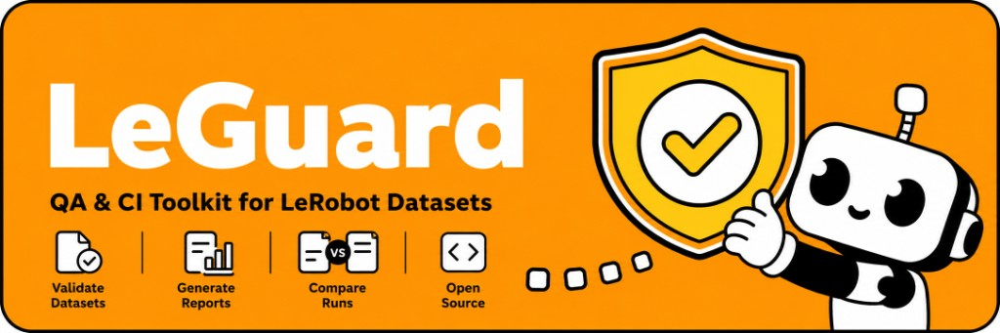

# LeGuard



[](./LICENSE)
[](./CHANGELOG.md)
[](https://www.rust-lang.org/)
[](./CODE_OF_CONDUCT.md)
[](./SECURITY.md)
[](./CONTRIBUTING.md)

LeGuard is an open-source QA and CI toolkit for LeRobot datasets. It validates dataset structure and data integrity, generates machine-readable and human-readable reports, and compares quality issues between two validation runs.

Live Space: [https://huggingface.co/spaces/praedico/LeGuard](https://huggingface.co/spaces/praedico/LeGuard)

## Core Capabilities

- `leguard-core`: dataset scanning, validation checks (`structure`, `schema`, `consistency`, `episodes`, `temporal`, `numerical`, `video`, `annotation`, `training`, `portability`), and issue diffing.
- `leguard-cli`: command-line interface with `check`, `report`, and `diff`, including direct Hugging Face dataset support.
- `leguard-report`: report rendering in `json`, `html`, `markdown`, and `junit`.
- `packages/github-action`: plug-and-play CI quality gate for GitHub Actions.

## Installation

### Option 1: Local build (development)

```bash
git clone https://github.com/praedico/LeGuard.git
cd LeGuard
cargo build --workspace
```

### Option 2: Release binary (CI)

The repository includes `.github/workflows/release.yml` to publish `leguard` binaries on GitHub tags (`v*`), along with a `SHA256SUMS` file for artifact verification.

## Quickstart

From the repository root:

```bash
cargo run -p leguard-cli -- check examples/fixtures/dataset-clean --fail-on error
cargo run -p leguard-cli -- report examples/fixtures/dataset-clean --format json --out clean-report.json
cargo run -p leguard-cli -- report examples/fixtures/dataset-broken --format json --out broken-report.json
cargo run -p leguard-cli -- diff clean-report.json broken-report.json --format json
```

## Validate a Hugging Face Dataset

You can now run `check` directly from an HF repo id:

```bash
cargo run -p leguard-cli -- check praedico/SO101_pillbox_vita --fail-on error --max-episodes 20 --checks structure,schema,consistency,episodes,training,portability
```

### Useful `check` options

- `--checks`: comma-separated subset of checks to run.
- `--max-episodes`: cap validation to the first N episodes for faster diagnostics on large datasets.
- `--fail-on error|warning`: choose the gate policy for exit code behavior.

Use the Hugging Face CLI to download dataset files directly from the Hub, then run LeGuard on the local download:

```bash
hf download praedico/SO101_pillbox_vita --repo-type dataset --local-dir hf-datasets/SO101_pillbox_vita
cargo run -p leguard-cli -- check hf-datasets/SO101_pillbox_vita --fail-on error
cargo run -p leguard-cli -- report hf-datasets/SO101_pillbox_vita --format json --out so101-report.json
cargo run -p leguard-cli -- report hf-datasets/SO101_pillbox_vita --format html --out so101-report.html
```

You can also use the Makefile shortcuts:

```bash
make hf-download HF_DATASET=praedico/SO101_pillbox_vita HF_LOCAL_DIR=hf-datasets/SO101_pillbox_vita
make hf-check HF_LOCAL_DIR=hf-datasets/SO101_pillbox_vita HF_FAIL_ON=error
make hf-report HF_LOCAL_DIR=hf-datasets/SO101_pillbox_vita HF_REPORT_JSON=so101-report.json HF_REPORT_HTML=so101-report.html
```

## Hugging Face Space Deployment

This repository includes a dedicated Space bundle in `space/`:

Live Space: [https://huggingface.co/spaces/praedico/LeGuard](https://huggingface.co/spaces/praedico/LeGuard)

- `space/Dockerfile`
- `space/app.py`
- `space/requirements.txt`
- `space/README.md`


## Understanding Command Outputs

- `check`: returns exit code `0` when the gate passes and `1` when it fails (`--fail-on error|warning`).
- `report`: writes a shareable artifact (`json` for automation, `html`/`markdown` for review, `junit` for CI systems).
- `diff`: compares two reports and returns `new_issues`, `fixed_issues`, `persistent_issues`, and count deltas.

## Example Fixtures

- `examples/fixtures/dataset-clean`: reference dataset for nominal validation.
- `examples/fixtures/dataset-broken`: intentionally broken dataset with common failures.
- `examples/fixtures/dataset-variant`: schema variant (see `examples/variant-config.yml`).

## Stable Output Contract

- Versioned schema via `schema_version` in each `leguard-report.json`.
- Schema specification: `docs/report-schema.md`.
- Compatibility policy: `docs/compatibility.md`.

## Community and Governance

- Contribution guide: `CONTRIBUTING.md`
- Code of Conduct: `CODE_OF_CONDUCT.md`
- Security policy: `SECURITY.md`
- Changelog: `CHANGELOG.md`

## GitHub Actions Integration

See `packages/github-action/README.md`.

Minimal setup:

```yaml
- name: LeGuard quality gate
  uses: ./packages/github-action
  with:
    dataset-path: examples/fixtures/dataset-clean
    fail-on: error
```

## Useful Development Commands

```bash
cargo fmt --all
cargo clippy --workspace --all-targets -- -D warnings
cargo test --workspace
```
